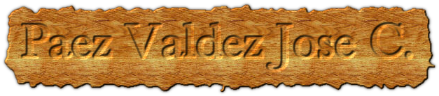

### Hi there 👋

<!--
**JoseCarlosPaezV/JoseCarlosPaezV** is a ✨ _special_ ✨ repository because its `README.md` (this file) appears on your GitHub profile.

Here are some ideas to get you started:

- 🔭 I’m currently working on ...
- 🌱 I’m currently learning ...
- 👯 I’m looking to collaborate on ...
- 🤔 I’m looking for help with ...
- 💬 Ask me about ...
- 📫 How to reach me: ...
- 😄 Pronouns: ...
- ⚡ Fun fact: ...
-->

|        | Lunes                           | Martes                          | Miercoles                       | Jueves                          | Viernes                         |
|--------|---------------------------------|---------------------------------|---------------------------------|---------------------------------|---------------------------------|
| 1:00pm | Ecuaciones Diferenciales        | Ecuaciones Diferenciales        | Ecuaciones Diferenciales        | Ecuaciones Diferenciales        | Ecuaciones Diferenciales        |
| 2:00pm | Taller de Sistemas Operativos   | Taller de Sistemas Operativos   | Taller de Sistemas Operativos   | Taller de Sistemas Operativos   |                                 |
| 3:00pm | Redes de Computadoras           | Redes de Computadoras           | Redes de Computadoras           | Redes de Computadoras           | Redes de Computadoras           |
| 4:00pm | Lenguajes de Interfaz           | Lenguajes de Interfaz           | Lenguajes de Interfaz           | Lenguajes de Interfaz           |                                 |
| 5:00pm | Lenguajes y Autonomas I         | Lenguajes y Autonomas I         | Lenguajes y Autonomas I         | Lenguajes y Autonomas I         | Lenguajes y Autonomas I         |
| 6:00pm | Administración de Base de Datos | Administración de Base de Datos | Administración de Base de Datos | Administración de Base de Datos | Administración de Base de Datos |
| 7:00pm | Programación Logica y Funcional | Programación Logica y Funcional | Programación Logica y Funcional | Programación Logica y Funcional | Programación Logica y Funcional |
|        |                                 |                                 |                                 |                                 |                                 |
